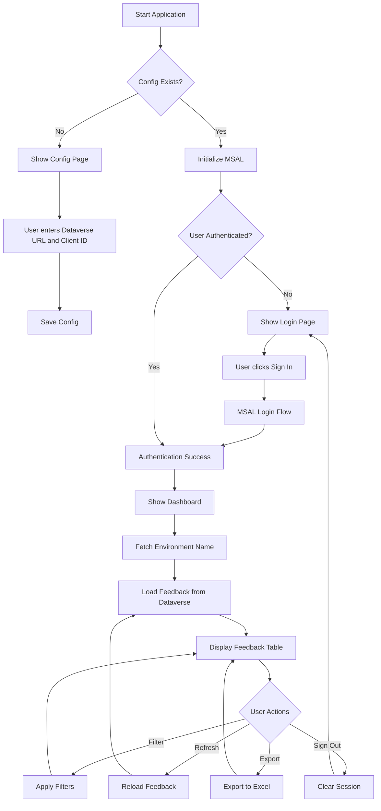

# Copilot Studio Feedback Viewer Application Flow

```mermaid
flowchart TD
    A[Start Application] --> B{Config Exists?}
    B -->|No| C[Show Config Page]
    C --> D[User enters Dataverse URL and Client ID]
    D --> E[Save Config]
    B -->|Yes| F[Initialize MSAL]
    F --> G{User Authenticated?}
    G -->|No| H[Show Login Page]
    H --> I[User clicks Sign In]
    I --> J[MSAL Login Flow]
    J --> K[Authentication Success]
    G -->|Yes| K
    K --> L[Show Dashboard]
    L --> M[Fetch Environment Name]
    M --> N[Load Feedback from Dataverse]
    N --> O[Display Feedback Table]
    O --> P{User Actions}
    P -->|Filter| Q[Apply Filters]
    Q --> O
    P -->|Refresh| R[Reload Feedback]
    R --> N
    P -->|Export| S[Export to Excel]
    S --> O
    P -->|Sign Out| T[Clear Session]
    T --> H
```